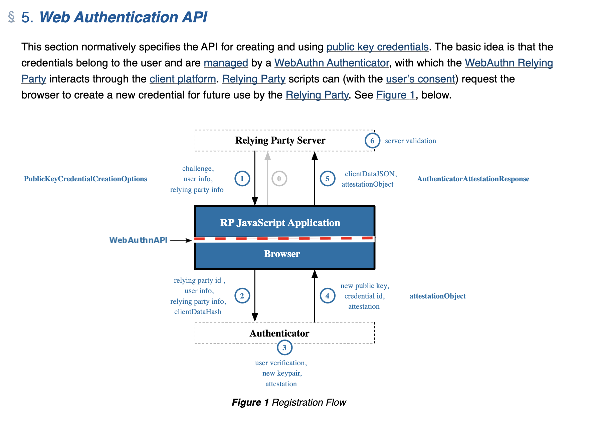
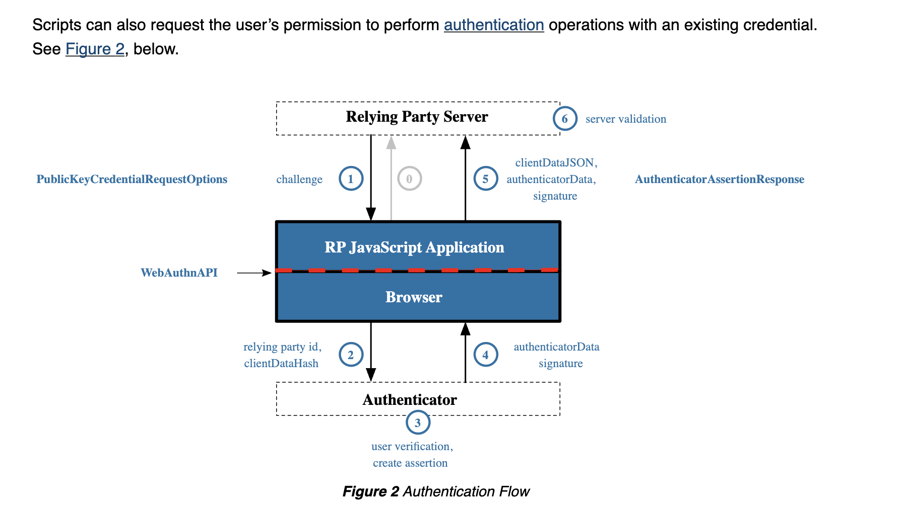

# Technical Paper - WebAuthN (Passwordless Solutions)
**Author**: Edgar Rios
**Date**: 12/20/2024
# Abstract
The purpose of this document is to conduct research on WebAuthn, otherwise known as passwordless solutions, to identify how the protocol functions, how it is addressing security problems associated with the use of passwords, and finally conduct research on whether WebAuthn could prevent account compromises. The research will involve a deep-dive into the WebAuthn specification and other technical papers.

# Introduction
## Security Problems with Passwords
Passwordless solutions (WebAuthn) are being implemented across industries to address the security problems associated with passwords. These problems grant the oppurtunity for actors with ill intent to conduct cyber attacks to obtain data that the password protects. 

Those cyber attacks include things like brute force, credential stuffing, person-in-the-middle, phishing, keylogging, rainbow table, shoulder surfing, sql injection, hijacking, replay (session), and many more. Password solutions are simply the next iteration of improvements to passwords, such as password hashing/salting/peppering, complexity and length requirements, rate limiting, multi-factor authentication, one-time passwords, biometric authentication, and many more. 

## Cyberattacks associated with Passwords and Mitigation examples
| **Cyberattack**       | **Description**       | **Mitigations**       |
|----------------|----------------|----------------|
| **Brute Force** | An attacker will try every possible combination for username/password with automated tooling until the correct combination is found.   Mitre: [Brute Force](https://attack.mitre.org/techniques/T1110/) | **Rate Limiting** - Limits the number of failed authetication attempts (typically 15 failed attempts). Will effectively stop a brute force attack since this attack requires trying thousands to millions of combinations until the correct combination is found.     **Multi-Factor Authentication** - Requires a user to present two or more forms of authentication. The forms of authentication include passwords, biometrics, one-time passwords, hardware tokens, and more. The second factor of authentication is not able to be brute-forced since it is usually out-of-band. |
| **Credential Stuffing**| An attacker will take a compromised credential and try to use it in different applications. This is sometimes successful since user’s tend to reuse passwords. | **Multi-Factor Authentication** - Requires a user to present two or more forms of authentication. The forms of authentication include passwords, biometrics, one-time passwords, hardware tokens, and more. |
| **Person-in-the-middle (MitM)** | An attacker sits in between the communication of a user (victim) and a web server, capturing credentials such as passwords, access tokens (JWTs), or cookies (bearer tokens). | **Multi-Factor Authentication** - Requires a user to present two or more forms of authentication. The forms of authentication include passwords, biometrics, one-time passwords, hardware tokens, and more. |
 **Phishing** | The most notarious cyberattacks to have been recorded typically involved phishing in some capacity. Attackers use social engineering tactics to trick users into providing their username/password and most recently to include the second factor of authentication (in applicable cases). | **Email Security** - There is suites of products that evaluate email for the various tactics that go into social engineering. The evaluation includes things like incorporating SPF and DMARC checks, scanning url’s for malicious content, and proprietary heuristics checks.     **User Awareness Training** - Organizations provide users with training to identify when a phishing attack may be occuring. Usually one of the best mitigations however attackers can still make it very difficult to detect even to a cybersecurity professional.     **Endpoint Detection and Response** - A software installed on a user’s computer to detect when a phishing attempt may be occuring. Looks for things like entropic domains, evaluates dns records with threat intelligence, identifies abnormal processes running on the computer, etc.     **Zero-Trust Security** - Zero-Trust is a set of principles for the evaluation of an access request. One of the principles includes incorporating as much telemetry in the access request to distinguish the level of risk associated with the request. For example, can consider the device, network location, security posture of the device, the resource the access requesst is trying to obtain, and more. In essence, provides multiple layers that an attacker would need to bypass.     **mTLS** - Requires that a client authenticates when establishing a TLS connection rather then just the server. Difficult to bypass because the client authenticates via a x509 digital certificate and its private key. This uses public key cryptography which is the foundation behind WebAuthn.     **DNS and URL Filtering** - Assesses a DNS request or a URL against threat intelligence to identify malicious behavior like phishing.     **Session and Browser Protections** - Sets various controls around http headers and how cookies are set in a users browser. This list is extensive so I will leave it at that.     **Multi-Factor Authentication** - Requires a user to present two or more forms of authentication. The forms of authentication include passwords, biometrics, one-time passwords, hardware tokens, and more. This unfortunately is not much of a mitigation but is often sited as the major mitigation. It can be easily bypassed via automated tooling. The Security Engineering team has conducted a proof of concept showing the ease of bypassing MFA. |
 | **Keylogging** | Malicious software that captures a user’s keyboard strokes. | **Endpoint Detection and Response** - A software installed on a user’s computer to detect when a abnormal process is running or uses heuristics to idenfiy known or unknown malicious software (amongst other things). |
 | **Rainbow Table** | Passwords are typically stored in a database in hash form. The hashing of a password is a process where it turns the password into a string of characters that is difficult to reverse.   The rainbow table attack is one where the attacker who has obtained a dump of passwords in hash form will compare the hashes against an enourmous database of hashes and when a match occurs, the database will provide the password pre hashing. Allowing the attacker to then use the password. |**Multi-Factor Authentication** - Requires a user to present two or more forms of authentication. The forms of authentication include passwords, biometrics, one-time passwords, hardware tokens, and more.     **Salting / Peppering** - During the hashing process, a random value (salt) is added to the password. Peppering works in a similar fashion but is stored outside of the database. Both provide the same result which is that without knowing the salt or pepper an attacker cannot perform a rainbow table attack. |
 | **Shoulder Surfing** | The act of an attacker looking over the shoulder of a victim as they input their password. |  **Multi-Factor Authentication** - Requires a user to present two or more forms of authentication. The forms of authentication include passwords, biometrics, one-time passwords, hardware tokens, and more. This thwarts shoulder surfing since the second factor is either always changing (so it is bound to a session) or its biometrics or hardware tokens where they would need the physical thing to successfully provide the second means of authentication. |
 | **SQL Injection**| An attacker will inject malicious SQL queries to obtain a password from a database. | **Multi-Factor Authentication** - Requires a user to present two or more forms of authentication. The forms of authentication include passwords, biometrics, one-time passwords, hardware tokens, and more. This thwarts sql injection since the second factor is either always changing (so it is bound to a session) or its biometrics or hardware tokens where they would need the physical thing to successfully provide the second means of authentication.     **Salting / Peppering** - If the SQL injection is sucessful and the attacker is able to obtain hashed passwords, then a salt or pepper can be added during the hashing process, a random value (salt) is added to the password. Peppering works in a similar fashion but is stored outside of the database. Both provide the same result which is that without knowing the salt or pepper an attacker cannot perform a rainbow table attack (the next step after a sql injection).     **Input Validation** - The web server only accepts predefined inputs. There are many ways to perform input validation and which are outside the scope of this paper. |
 | **Hijacking  / Replay (session)**| An attacker steals session cookies (hijacking) or access/refresh tokens (session) and uses these to perform authentication without needing the password. | **TTL** - In most cases, it is highly recommended to consider using short lifetimes for cookies or access tokens to bound and reduce the attack to a time window.     **Session and Browser Protections** - Sets various controls around http headers and how cookies are set and used in a users browser. This list is extensive so I will leave it at that.     **Nonces** - A unique number used in a request, a replay of the request will fail since the nonce would have been used already.     **Challenge-Response** - A server sends a challenge that an identity can only solve. This will be explored later since WebAuthn implements controls such as these.    **mTLS** - Requires that a client authenticates when establishing a TLS connection rather then just the server. Difficult to bypass because the client authenticates via a x509 digital certificate and its private key. This uses public key cryptography which is the foundation behind WebAuthn.     **Token Binding** - Token binding involves matching a access token to a device, IP address, or other attributes. Preventing the token to be reused when the key-value pairs fail to match. 

## Security Benefits of Public Key Cryptography in WebAuthn - Addressing the Security Problems
There exists a couple of themes related to Security Problems with Passwords that make up the majority of the challenges. The challenges and themes include

* **Storage** - The secret (password) must be stored in a variety of places. Application’s must store a user’s password (i.e. plaintext, hashed, salted/peppered) in a database to validate the identity of the user requesting a resource. User’s also choose to store their passwords in plaintext, encrypted (password managers), or choose to memorize their passwords. 

* **Revealing the secret to a trusted party** - A user must disclose the password to a trusted party, creating multiple windows of oppurtunity that attackers have quickly picked up and creating tactics and techniques to exploit such windows. 

In some cyberattacks like phishing or hijacking it is a combination of both of these themes. However, the revealing of the secret is by far the most challenging to fix, however WebAuthn is solving the challenge via the use of public key cryptography and multiple challenge-response mechanisms. 

**DUE TO A LIMITATION IN MARKDOWN I AM UNABLE TO MERGE CELLS IN THE FOLLOWING TABLE, APOLOGIES FOR THE POOR READBILITY**
| **Cyberattack**       | **WebAuthN Application and Mechanism**
|----------------|----------------|
| **Brute Force** &   **Keylogging** &   **Shoulder Surfing** | In the WebAuthn Authentication operation, there is no prompt to input a password, effectively stopping any brute force attack from occuring, preventing a keylogger from capturing the password, and a ease dropper from seeing your password.     Instead of inputting a password, a user in the WebAuthn Authentication operation will instead prove that they own the private key associated with the registered public key by providing a [assertion](https://www.w3.org/TR/webauthn-3/#authentication-assertion). The assertion is a response to the [authenticatorGetAssertion](https://www.w3.org/TR/webauthn-3/#authenticatorgetassertion) operation and contains the assertion signature which is signed by the private key (as seen in step 12). The relying party server then validates the assertion signature (amongst other things that are important for other attacks, which I will get to later) by using the public key stored in the database associated with the user (done in WebAuthn Registration Operation).| 
| **Person-in-the-Middle** &   **Phising** &   **Hijacking / Replay (session)**|A person-in-the-middle attack occurs when an attacker is in between communication of a victim and a relying party. The attacker would first typically start this attack via phishing and chain this attack with a hijacking or replay attack to ultimately have completed an account compromise.     There exists multiple challenge-response mechanisms to eliminate this type of attack.     1. In the WebAuthn Registration Operation and in the WebAuthn Authentication operation a [challenge](https://w3c.github.io/webauthn/#dom-publickeycredentialcreationoptions-challenge) is set by the relying party that is unique and [atleast of 16 bytes long](https://w3c.github.io/webauthn/#sctn-cryptographic-challenges) to prevent guessing the challenge. This ensures that if an attacker intercepts the assertion, it cannot be reused in a later request since the challenge is unique to the session. It works similarly to a one-time passcode but is offloaded from a user to the underlying WebAuthn cryptographic protocol (is best on how I understand it). The assertion is what proves the ownership of the private key so a forged request with this stolen assertion cannot be reused.     2. A [signature counter](https://www.w3.org/TR/webauthn-3/#signature-counter) feature is implemented and set in the [authenticator data object](https://www.w3.org/TR/webauthn-3/#authenticator-data). The signature counter's purpose is to aid [Relying Parties](https://www.w3.org/TR/webauthn-3/#relying-party) in detecting cloned authenticators. The signature counter is incremented for each successful [authenticatorGetAssertion](https://www.w3.org/TR/webauthn-3/#authenticatorgetassertion) operation by some positive value, and subsequent values are returned to the [WebAuthn Relying Party](https://www.w3.org/TR/webauthn-3/#webauthn-relying-party) within the [authenticator data](https://www.w3.org/TR/webauthn-3/#authenticator-data) again. If a mismatch occurs then it is reasonable to expect a cloned authenticator.     3. The final challenge-response comes from key-value pairs set in clientDataJSON as part of the WebAuthn Registration Operation and in the WebAuthn Authentication operation where the authentication assertion stores the origin and relying party id (key-value pairs). This is best illustrated in the diagram found in the Authentication with a WebAuthn Credential, in step 2 you see the browser set the relying party id, which contains the origin of the request, then in step 5 and 6 you see the server validate clientDataJSON which stores the relying party id. If origin and relying party id do not match then the chrome browser code snippet of OriginIsAllowedToClaimRelyingPartyId would fail and preventing the connection from proceeding further. If the relying party id and origin match then the assertion would succeed normally. This prevents a person-in-the-middle using phishing to replay a stolen cookie or access token since it cuts the connection prior to the cookie or token being set.  | 
| **Rainbow Table** &   **SQL Injection** &   **Credential Stuffing** | Credential Stuffing, SQL Injection, and Rainbow Table attacks result from a leaked password. Which has been either revealed in plaintext or has reversed the password from its hashed form using rainbow table attacks (either using salt and pepper or not).     In the WebAuthn Authentication operation, there is no storage of a user’s password in a relying parties database but instead stores a user’s public key. So even if an attacker has successfuly performed a sql injection or dumped a database of public keys then these public keys are useless and are intended to be public. It also aids security professional’s and corporations who maintain these databasess by eliminating the impact associated with their infrastructure being breached.     This is best explained by the [Credential Record](https://www.w3.org/TR/webauthn-3/#credential-record), which is a part of the [WebAuthn Relying Party Operation](https://www.w3.org/TR/webauthn-3/#sctn-rp-operations), in which after the attestation statement is verified sucessfully and found to be trustworthy then a credential record will be created for the user. The credential record contains the user’s public key ([amongst other things](https://www.w3.org/TR/webauthn-3/#reg-ceremony-store-credential-record) that are important to derail other attacks which I will get to later) which is used when validating the assertion signature when performing the Authentication Operation. |

### Summary
1. **No Passwords**: WebAuthn eliminates passwords by replacing them with key pairs. Users don’t need to remember or manage passwords, reducing the risk of password-related attacks like phishing, credential stuffing, and brute-force attacks.

2. **Phishing Resistance**: Attackers cannot steal the private key because it never leaves the user’s device, and the signature challenge-response and counter mechanism prevents attackers from reusing stolen credentials.

3. **Device-Based Authentication**: The private key is tied to the specific device, making it difficult for attackers to impersonate the user without having physical access to their device.

4. **Multi-Factor Capabilities**: WebAuthn can easily integrate multi-factor authentication (MFA), where the private key is combined with other factors like biometrics (fingerprint, facial recognition) or PINs. This ensures that even if someone gains access to the device, they need additional authentication factors.

5. **Unique Key Pairs Per Site**: Each web service has its own public-private key pair. Even if one service is compromised, the keys cannot be reused for other services, unlike passwords which may be reused across multiple accounts.

# What is Passwordless Authentication?
## WebAuthn Specification Intro
The [WebAuthn Specification](https://w3c.github.io/webauthn/#sctn-intro) is a set of APIs that allows servers to register and authenticate users using public key cryptography instead of a password. The marketing term for conforming to the WebAuthn specification is called Passwordless Authentication.  

## Public Key Cryptography
Public Key cryptography (AKA assymetric encryption) is a system that uses a key-pair that is comprised of a private and public key for a variety of applications such as secure communication, digital signatures, authentication, and more. It is the cornerstone of trust on the internet and vital for the internet to function. The premise of assymetric encryption is that we can distribute the public key to inquiring third-parties and use the private key to attest the identity of the public key owner. The public key is used as a challenge and the private key is used to satisfy the challenge, it is mathetically impossible (currently) to decipher the private key from the public key. 

In this particular case, WebAuthn relies upon the digital signatures application of public key cryptography to provide authentication. There is two facets to digital signatures:

* **Signing**: The private key is used to create a digital signature that verifies the sender's identity and the integrity of the message. This signature can be attached to a message or document.

* **Verification**: The recipient or anyone with the sender's public key can verify the authenticity of the signature and ensure that the message hasn’t been tampered with.

We will later explore how these two facets provides the means to eliminate the use of passwords.

## WebAuthN Components

### Key Components of WebAuthn
There exist many components to WebAuthn, and they are listed in Section 4 of the [WebAuthn Specification](https://www.w3.org/TR/webauthn-3/#sctn-terminology). However, the following table will outline key components and categorize them where possible for succinctness.

| **Component**               | **Description**                                                                                                                                                                                                                                                                                                                                                                                                                                                                                                                                                                     |
|-----------------------------|---------------------------------------------------------------------------------------------------------------------------------------------------------------------------------------------------------------------------------------------------------------------------------------------------------------------------------------------------------------------------------------------------------------------------------------------------------------------------------------------------------------------------------------------------------------------------------|
| **Authenticator**           | A cryptographic entity, existing in hardware or software, that can register a user with a given [Relying Party](https://www.w3.org/TR/webauthn-3/#relying-party) and later assert possession of the registered [public key credential](https://www.w3.org/TR/webauthn-3/#public-key-credential), and optionally verify the user to the Relying Party. Authenticators can report information regarding their type and security characteristics via [attestation](https://www.w3.org/TR/webauthn-3/#attestation) during registration and assertion.    A WebAuthn Authenticator could be a [roaming authenticator](https://www.w3.org/TR/webauthn-3/#roaming-authenticators), a dedicated hardware subsystem integrated into the client device, or a software component of the client or client device. A WebAuthn Authenticator is not necessarily confined to operating in a local context, and can generate or store a [credential key pair](https://www.w3.org/TR/webauthn-3/#credential-key-pair) in a server outside of client-side hardware.     In general, an authenticator is assumed to have only one user. If multiple natural persons share access to an authenticator, they are considered to represent the same user in the context of that authenticator. If an authenticator implementation supports multiple users in separated compartments, then each compartment is considered a separate authenticator with a single user with no access to other users' credentials. |
| **Client (WebAuthn Client)**| Also referred to herein as simply a client. See also [Conforming User Agent](https://www.w3.org/TR/webauthn-3/#conforming-user-agent). A WebAuthn Client is an intermediary entity typically implemented in the user agent (in whole, or in part). Conceptually, it underlies the [Web Authentication API](https://www.w3.org/TR/webauthn-3/#web-authentication-api) and embodies the implementation of the `[[Create]](origin, options, sameOriginWithAncestors)` and `[[DiscoverFromExternalSource]](origin, options, sameOriginWithAncestors)` internal methods. It is responsible for both marshalling the inputs for the underlying [authenticator operations](https://www.w3.org/TR/webauthn-3/#authenticator-operations), and for returning the results of the latter operations to the Web Authentication API's callers.     The WebAuthn Client runs on, and is distinct from, a WebAuthn Client Device. |
| **Client Device**           | The hardware device on which the WebAuthn Client runs, for example a smartphone, a laptop computer or a desktop computer, and the operating system running on that hardware. The distinctions between a [WebAuthn Client Device](https://www.w3.org/TR/webauthn-3/#client-device) and a client are: <ul><li>A single client device **MAY** support running multiple clients, i.e., browser implementations, which all have access to the same authenticators available on that client device, and</li><li>[Platform authenticators](https://www.w3.org/TR/webauthn-3/#platform-authenticators) are bound to a client device rather than a WebAuthn Client.</li></ul> A client device and a client together constitute a client platform. |
| **Client Platform**         | A client device and a client together make up a client platform. A single hardware device **MAY** be part of multiple distinct client platforms at different times by running different operating systems and/or clients.                                                                                                                                                                                                                                                                                                                                                                                             |
| **Public & Private Keys**   | A [credential key pair](https://www.w3.org/TR/webauthn-3/#credential-key-pair) is a pair of asymmetric cryptographic keys generated by an authenticator and scoped to a specific WebAuthn Relying Party. It is the central part of a public key credential.     A [credential public key](https://www.w3.org/TR/webauthn-3/#credential-public-key) is the public key portion of a credential key pair. The credential public key is returned to the Relying Party during a [registration ceremony](https://www.w3.org/TR/webauthn-3/#registration-ceremony).     A [credential private key](https://www.w3.org/TR/webauthn-3/#credential-private-key) is the private key portion of a credential key pair. The credential private key is bound to a particular authenticator - its managing authenticator - and is expected to never be exposed to any other party, not even to the owner of the authenticator.     Note that in the case of [self attestation](https://www.w3.org/TR/webauthn-3/#self-attestation), the credential key pair is also used as the attestation key pair, see self attestation for details. |
| **Relying Party**           | A Relying Party implementation typically consists of both some client-side script that invokes the [Web Authentication API](https://www.w3.org/TR/webauthn-3/#web-authentication-api) in the client, and a server-side component that executes the [Relying Party operations](https://www.w3.org/TR/webauthn-3/#sctn-rp-operations) and other application logic. Communication between the two components **MUST** use HTTPS or equivalent transport security, but is otherwise beyond the scope of this specification. |
| **Registration Ceremony**   | The ceremony where a user, a Relying Party, and the user’s [client platform](https://www.w3.org/TR/webauthn-3/#client-platform) (containing or connected to at least one authenticator) work in concert to create a [public key credential](https://www.w3.org/TR/webauthn-3/#public-key-credential) and associate it with a user account. Note that this includes employing a [test of user presence](https://www.w3.org/TR/webauthn-3/#test-of-user-presence) or [user verification](https://www.w3.org/TR/webauthn-3/#user-verification). After a successful registration ceremony, the user can be authenticated by an authentication ceremony.     The WebAuthn registration ceremony is defined in [§ 7.1 Registering a New Credential](https://www.w3.org/TR/webauthn-3/#sctn-registering-a-new-credential), and is initiated by the Relying Party invoking a `navigator.credentials.create()` operation with a `publicKey` argument. See [§ 5 Web Authentication API](https://www.w3.org/TR/webauthn-3/#sctn-api) for an introductory overview and [§ 1.3.1 Registration](https://www.w3.org/TR/webauthn-3/#sctn-sample-registration) for implementation examples. |
| **Authentication Ceremony** | The ceremony where a user, and the user’s [client platform](https://www.w3.org/TR/webauthn-3/#client-platform) (containing or connected to at least one authenticator) work in concert to cryptographically prove to a [Relying Party](https://www.w3.org/TR/webauthn-3/#relying-party) that the user controls the [credential private key](https://www.w3.org/TR/webauthn-3/#credential-private-key) of a previously-registered public key credential (see [Registration Ceremony](https://www.w3.org/TR/webauthn-3/#registration-ceremony)). Note that this includes a [test of user presence](https://www.w3.org/TR/webauthn-3/#test-of-user-presence) or [user verification](https://www.w3.org/TR/webauthn-3/#user-verification).     The WebAuthn authentication ceremony is defined in [§ 7.2 Verifying an Authentication Assertion](https://www.w3.org/TR/webauthn-3/#sctn-verifying-assertion), and is initiated by the Relying Party invoking a `navigator.credentials.get()` operation with a `publicKey` argument. See [§ 5 Web Authentication API](https://www.w3.org/TR/webauthn-3/#sctn-api) for an introductory overview and [§ 1.3.3 Authentication](https://www.w3.org/TR/webauthn-3/#sctn-sample-authentication) for implementation examples. |
| **Relying Party Identifier (RP ID)** | In the context of the WebAuthn API, a relying party identifier is a valid domain string identifying the WebAuthn Relying Party on whose behalf a given registration or authentication ceremony is being performed. A public key credential can only be used for authentication with the same entity (as identified by RP ID) it was registered with.    By default, the RP ID for a WebAuthn operation is set to the caller’s origin's effective domain. This default **MAY** be overridden by the caller, as long as the caller-specified RP ID value is a registrable domain suffix of or is equal to the caller’s origin's effective domain.    Note: An RP ID is based on a host's domain name. It does not itself include a scheme or port, as an origin does. The RP ID of a public key credential determines its scope. I.e., it determines the set of origins on which the public key credential may be exercised, as follows:   - The RP ID must be equal to the origin's effective domain, or a registrable domain suffix of the origin's effective domain.   - The origin's scheme must be `https`.   - The origin's port is unrestricted.    For example, given a Relying Party whose origin is `https://login.example.com:1337`, then the following RP IDs are valid: `login.example.com` (default) and `example.com`, but not `m.login.example.com` and not `com`.    This is done in order to match the behavior of pervasively deployed ambient credentials (e.g., cookies, [RFC6265](https://www.rfc-editor.org/rfc/rfc6265)). Please note that this is a greater relaxation of "same-origin" restrictions than what `document.domain`'s setter provides.    These restrictions on origin values apply to WebAuthn Clients.     Other specifications mimicking the WebAuthn API to enable WebAuthn public key credentials on non-Web platforms (e.g., native mobile applications) **MAY** define different rules for binding a caller to a Relying Party Identifier. Though, the RP ID syntaxes **MUST** conform to either valid domain strings or URIs ([RFC3986](https://www.rfc-editor.org/rfc/rfc3986), [URL](https://url.spec.whatwg.org/)). |

## Using the WebAuthN API
There exists two main operations when using the WebAuthn API:

1. Registering

2. Authentication

### Registering a WebAuthN Credential

This is the first-time flow, in which a new credential is created and registered with the server. In this flow, the WebAuthn Relying Party does not have a preference for platform authenticator or roaming authenticators.

1. The user visits Example Domain , which serves up a script. At this point, the user may already be logged in using a legacy username and password, or additional authenticator, or other means acceptable to the Relying Party. Or the user may be in the process of creating a new account.

2. The Relying Party script runs the code snippet below.

3. The client platform searches for and locates the authenticator.

4. The client connects to the authenticator, performing any pairing actions if necessary.

5. The authenticator shows appropriate UI for the user to provide a biometric or other authorization gesture.

6. The authenticator returns a response to the client, which in turn returns a response to the Relying Party script. If the user declined to select an authenticator or provide authorization, an appropriate error is returned.

7. If a new credential was created,

    - The Relying Party script sends the newly generated credential public key to the server, along with additional information such as attestation regarding the provenance and characteristics of the authenticator.

    - The server stores the credential public key in its database and associates it with the user as well as with the characteristics of authentication indicated by attestation, also storing a friendly name for later use.

    - The script may store data such as the credential ID in local storage, to improve future UX by narrowing the choice of credential for the user.

### Authenticating with a WebAuthN Credential

This is the flow when a user with an already registered credential visits a website and wants to authenticate using the credential.

1. The user visits Example Domain , which serves up a script.

2. The script asks the client for an Authentication Assertion, providing as much information as possible to narrow the choice of acceptable credentials for the user. This can be obtained from the data that was stored locally after registration, or by other means such as prompting the user for a username.

3. The Relying Party script runs one of the code snippets below.

4. The client platform searches for and locates the authenticator.

5. The client connects to the authenticator, performing any pairing actions if necessary.

6. The authenticator presents the user with a notification that their attention is needed. On opening the notification, the user is shown a friendly selection menu of acceptable credentials using the account information provided when creating the credentials, along with some information on the origin that is requesting these keys.

7. The authenticator obtains a biometric or other authorization gesture from the user.

8. The authenticator returns a response to the client, which in turn returns a response to the Relying Party script. If the user declined to select a credential or provide an authorization, an appropriate error is returned.

9. If an assertion was successfully generated and returned,

    - The script sends the assertion to the server.

    - The server examines the assertion, extracts the credential ID, looks up the registered credential public key in its database, and verifies the assertion signature. If valid, it looks up the identity associated with the assertion’s credential ID; that identity is now authenticated. If the credential ID is not recognized by the server (e.g., it has been deregistered due to inactivity) then the authentication has failed; each Relying Party will handle this in its own way.

    - The server now does whatever it would otherwise do upon successful authentication -- return a success page, set authentication cookies, etc.

### Security Considerations when using WebAuthN
The following topics are the [security considerations outlined in the WebAuthn Specification](https://w3c.github.io/webauthn/#sctn-security-considerations). I will be providing a high level overview of what each means. 

[Credential ID](https://w3c.github.io/webauthn/#sctn-credentialIdSecurity)

This threat is one where an attacker changes the credential ID to authenticate to another user’s account. This would fail since a check of the forged credential ID would pull the forged credential IDs public key and the request would be using a different private key not associated with the credential ID. 

[Security Considerations for Authenticators](https://w3c.github.io/webauthn/#sctn-security-considerations-authenticator)

This talks about how authenticators should incorporate a three-tier hierarchy for their Public Key Infrastructure. The multiple tiers are intended to reduce the impact of a compromised private key of a signing certificate authority. A common mitigation for those building PKI environments. 

It also talks about what it means for a signing certificate authorities private keys becoming compromised. In WebAuthn, a compromise of a signing certificate authority does not compromise the integrity of the leaf certificate. However, the leaf certificates should still be revoked.

[Security Considerations for Relying third Parties](https://w3c.github.io/webauthn/#sctn-security-considerations-rpr)

This explains the benefits that a relying third party can expect when using WebAuthn with some suggestions. Primarily for the eyes of lets say Microsoft.

[Visibility Considerations for Embedded Usage](https://w3c.github.io/webauthn/#sctn-seccons-visibility)

This notifies relying third parties to consider the risk of clickjacking due to the use of iframes. 

[Cryptographic Challenges](https://w3c.github.io/webauthn/#sctn-cryptographic-challenges)

This notifies relying third parties that the challenges must be randomly generated and unique, otherwise they stand to compromise the security of the WebAuthn protocol as they are crucial to mitigating replay and man-in-the-middle attacks. 

[Attestation Limitations](https://w3c.github.io/webauthn/#sctn-attestation-limitations)

This notifies relying third parties that securing the private keys of authenticators is paramount and if leaked allows the potential for man-in-the-middle attacks. Therefore they should conform to the standard. 

[Revoked Attestation Certificates](https://w3c.github.io/webauthn/#sctn-revoked-attestation-certificates)

This notifies relying third parties that when validating the certificate chain in the registration or authentication phases, if the certificate fails due to a revoked certificate then they should reject the requests. Also to then unregister the devices. 

[Credential Loss and Key Mobility](https://w3c.github.io/webauthn/#sctn-credential-loss-key-mobility)

This notifies relying third parties that the specification did not address the storage of the private key but instead presummes the private key will never leave the authenticator and no duplicates are created. The loss of the authenticator means the loss of the private key. Therefore they recommend that a user register multiple authenticators for backup and key recovery purposes. 

[Unprotected account detection](https://w3c.github.io/webauthn/#sctn-unprotected-account-detection)

This notifies relying third parties that they should make failed attempts of this protocol difficult to determine, similar to how you do not provide detailed information in error messages because then it gives the attacker information to work off of. In this case, the attacker would know that a user does or does not use WebAuthn and if it does not then the attacker will focus on users using the legacy authentication method of username/password. 

[Code injection attacks](https://w3c.github.io/webauthn/#sctn-code-injection)

This notifies relying third parties that malicious code running on the origin invalidates all security guarantees provided by WebAuthn, and that secure contexts (TLS/HTTPS) must be used when performing operations. The section then goes into a couple of scenarios of where malicious code can run and provides some recommendations. 

[Validating the origin of a credential](https://w3c.github.io/webauthn/#sctn-validating-origin)

This notifies relying third parties that they must validate the origin and toporigin of the request. If they do not validate then the protections against phishing, man-in-the-middle, hijacking are invalidated! It then provides examples of how to validate and what are acceptable origins. 

# References / Resources
**Specifications / RFCs**

- [WebAuthn Specification](https://w3c.github.io/webauthn/#sctn-intro)

**Blogs**

- [Phishing Attacks – WebAuthn to the ](https://www.slashid.dev/blog/webauthn-antiphishing/)

**WebAuthn Guide**

- [WebAuthn](https://webauthn.guide/)

- [WebAuthn Demo - try it yourself](https://webauthn.io/)

**Public Key Cryptography**

- [Wikipedia](https://en.wikipedia.org/wiki/Public-key_cryptography)
